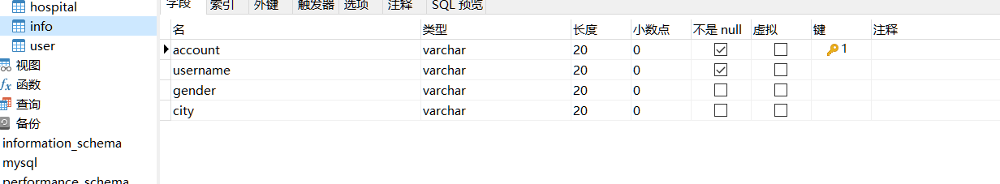

# Citi_Cup_backend

#### 安装教程

1.  IntelliJ IDEA
2.  mysql

#### 使用说明

1.  建立本地数据库Citi_Cup,各表如下

2.  下载该仓库，运行DemoTest.main测试

3.新建表agency,product,agency_product,user_product

#### 参与贡献

1.  Fork 本仓库
2.  新建 Feat_xxx 分支
3.  提交代码
4.  新建 Pull Request

